# 进程管理

## 1. 进程的定义

- 定义：在计算机发展史上，“进程"是为了解决什么问题而被引入的？
- 组成：每个进程由哪些部分组成？
- 组织方式：系统中各个进程之间是如何被组织起来的？
- 特征：相比于程序，进程有哪些特征？

引入**多道程序技术**之后：为了方便操作系统管理，完成各程序并发执行，引入了**进程**、**进程实体**的概念。

内存中同时放入多道程序，各个程序的代码、运算数据存放的位置不同。操作系统要怎么才能找到各程序的存放位置呢？

系统为每个运行的程序配置一个数据结构，称为**进程控制块**（**PCB**），用来描述进程的各种信息（如程序代码存放位置）

**PCB、程序段、数据段**三部分构戚了**进程实体**（**进程映像**）。

一般情况下，我们把进程实体就简称为进程，例如，所谓创建进程，实质上是创建进程实体中的 PCB；而撤销进程，实质上是撤销进程实体中的 PCB。

> 注意：**PCB 是进程存在的唯一标志！**

从不同的角度，进程可以有不同的定义，比较传统典型的定义有：

1. 进程是程序的一次**执行过程**。
2. 进程是一个程序及其数据在处理机上顺序执行时所**发生的活动**。
3. 进程是具有独立功能的程序在数据集合上**运行的过程**，它是系统进行资源分配和调度的一个独立单位.

> 强调“**动态性**”。

引入进程实体的概念后，可把进程定义为：

**进程**是进程实体的**运行过程**，是操作系统**进行资源分配和调度的一个独立单位**。

> 注意：
>
> 严格来说，进程实体和进程并不一样，**进程实体是静态的**，**进程则是动态的**。
>
> 不过，除非题目专门考察二者区别，否则可以认为进程实体就是进程。
>
> 因此我们也可以说“进程由程序段、数据段、PCB 三部分组成”。

## 2. 进程的组成

- PCB：操作系统通过 PCB 来管理进程，因此 PCB 中应该包含操作系统对其进行管理所需的各种信息
- 程序段：程序代码即存放在此
- 数据段：程序运行时使用、产生的运算数据。如全局变量、局部变量、宏定义的常量就存放在数据段内

PCB 的组成：

- 进程描述信息
  - 进程标识符 PID
  - 用户标识符 UID
- 进程控制和管理信息
  - 进程当前状态
  - 进程优先级
- 资源分配清单
  - 程序段指针
  - 数据段指针
  - 键盘
  - 鼠标
- 处理机相关信息
  - 各种寄存器值

> 当进程切换时需要把进程当前的运行情况记录下来保存在 PCB 中，如程序计数器的值表示了当前程序执行到哪一句。

PCB 的组成（另一种说法）：

- 进程标识符
- 处理机状态
- 进程调度信息
- 进程控制信息

进程的组成：

- PCB：进程的管理者（操作系统）所需的数据都在 PCB 中
  - 进程描述信息
  - 进程控制和管理信息
  - 资源分配清单
  - 处理机相关信息
- 程序段：存放要执行的代码
- 数据段：存放程序运行过程中处理的各种数据

## 3. 进程的组织

在一个系统中，通常有数十、数百乃至数千个 PCB。为了能对他们加以有效的管理，应该用适当的方式把这些 PCB 组织起来。

> 注意：
>
> 进程的组成讨论的是一个进程内部由哪些部分构成的问题；
>
> 而进程的组织讨论的是多个进程之间的组织方式问题。

进程的组织方式：

- 链接方式
  - 按照进程状态将 PCB 分为多个队列
  - 操作系统持有指向各个队列的指针
- 索引方式
  - 根据进程状态的不同，建立几张索引表
  - 操作系统持有指向各个索引表的指针

### 3.1. 链接方式

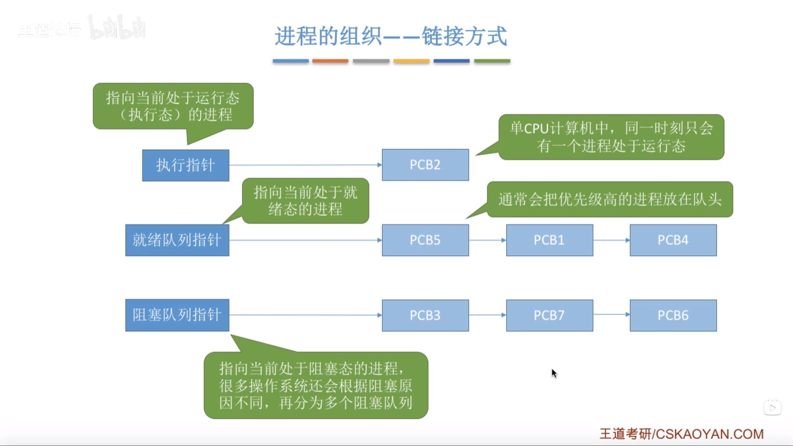

### 3.2. 索引方式

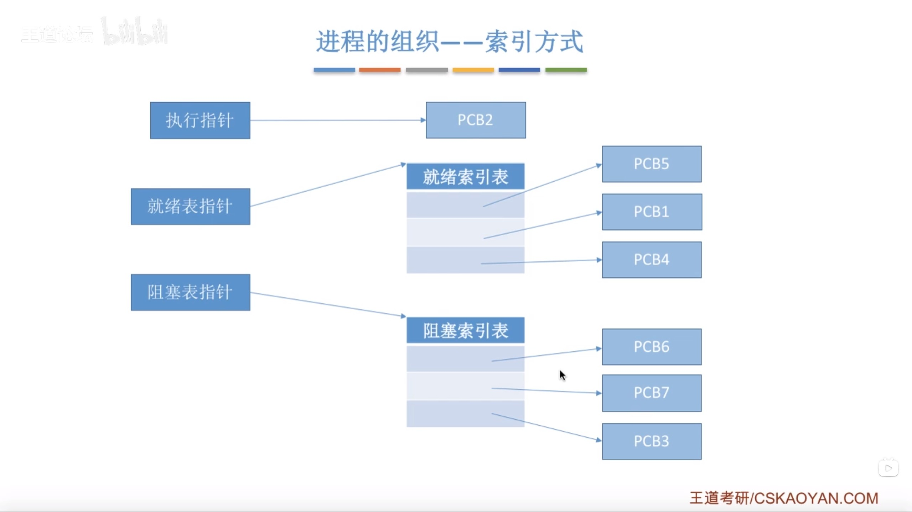

## 4. 进程的特征

- **动态性**：进程是程序的一次执行过程，是动态地产生、变化和消亡的
- 并发性：内存中有多个进程实体，各进程可并发执行
- 独立性：进程是能独立运行、独立获得资源、独立接受调度的基本单位
- 异步性：各进程按各自独立的、不可预知的速度向前推进，操作系统要提供“进程同步机制"来解决异步问题
- 结构性：每个进程都会配置一个 PCB。结构上看，进程由程序段、数据段、PCB 组成

> 注意：
>
> **动态性**是进程最基本的特征。
>
> **独立性**是指进程是操作系统进行资源分配和调度的一个独立单位。
>
> **异步性**有可能会导致并发程序执行结果的不确定性。

## 5. 进程的状态与转换

进程的状态：

- 运行状态
- 就绪状态
- 阻塞状态
- 创建状态
- 终止状态

进程状态间的转换：

- 就绪态 -> 运行态 : 获得处理机资源，进程被调度
- 运行态 -> 就绪态 ：时间片到，或处理机被抢占
- 运行态 -> 阻塞态 ：系统调用（进程主动行为）
- 阻塞态 -> 就绪态 ：申请的资源被分配，或等待的事件发生（进程被动行为）

进程是程序的一次执行。在这个执行过程中，有时进程正在被 CPU 处理，有时又需要等待 CPU 服务，可见，进程的状态是会有各种变化。为了方便对各个进程的管理，操作系统需要将进程合理地划分为几种状态。

进程的**三种基本状态**：

- **运行态**（Running）：占有 CPU，并在 CPU 上运行
  - 单核处理机环境下，每时刻最多只有一个进程处于运行态
  - 双核环境下可以同时有两个进程处于运行态
- **就绪态**（Ready）：已经具备运行条件，但由于没有空闲 CPU，而暂时不能运行
  - 进程已经拥有了除处理机之外所有需要的资源，一旦获得处理机，即可立即进入运行态开始运行
  - 即：万事俱备，只欠 CPU
- **阻塞态**（Waiting / Blocked，又称：等待态）：因等待某一事件而暂时不能运行
  - 如：等待操作系统分配打印机、等待读磁盘操作的结果
  - CPU 是计算机中最昂贵的部件，为了提高 CPU 的利用率，需要先将其他进程需要的资源分配到位，才能得到 CPU 的服务

进程的另外两种状态：

- 创建态（New，又称：新建态）：进程正在被创建，操作系统为进程分配资源、初始化 PCB
- 终止态（Terminated，又称：结束态）：进程正在从系统中撒销，操作系统会回收进程拥有的资源、撤销 PCB

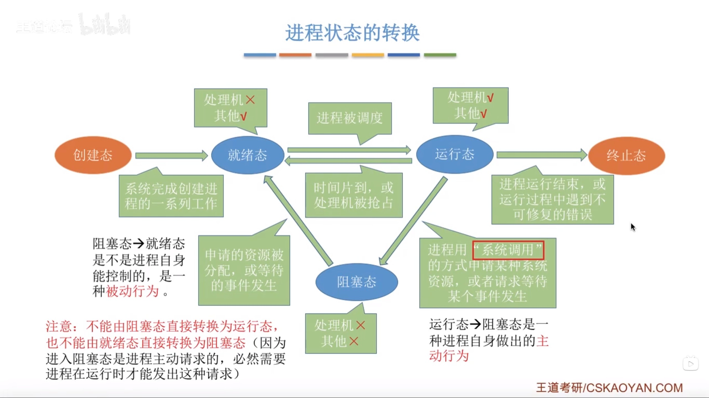

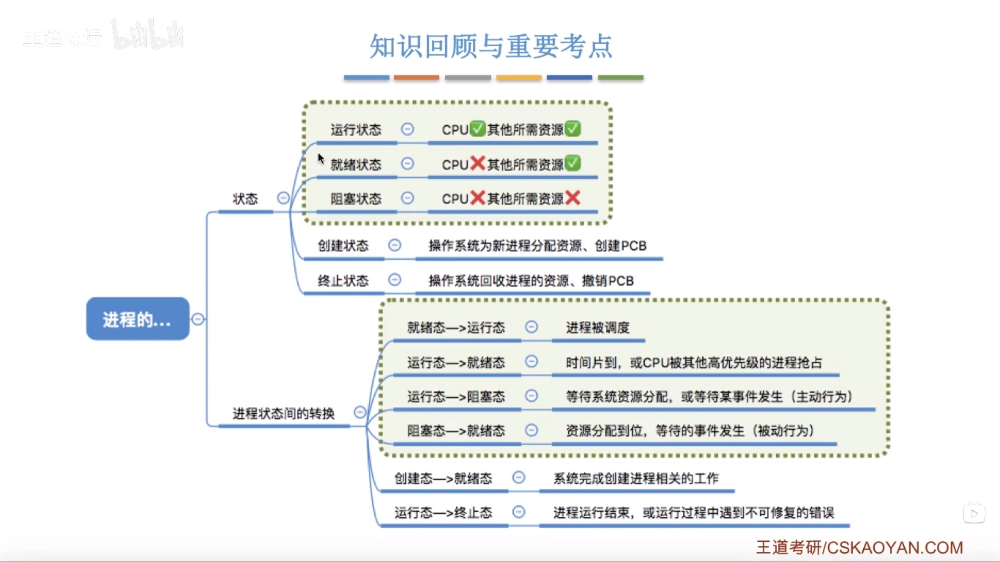

## 6. 进程控制

基本概念：

- 什么是进程控制
- 如何实现进程控制：用“原语”实现

进程控制相关的原语：

- 进程的创建
- 进程的终止
- 进程的阻塞
- 进程的唤醒
- 进程的切换

### 6.1. 进程控制

进程控制的主要功能是对系统中的所有进程实施有效的管理，它具有创建新进程、撤销已有进程、实现进程状态转换等功能。

简化理解：反正**进程控制就是要实现进程状态转换**。

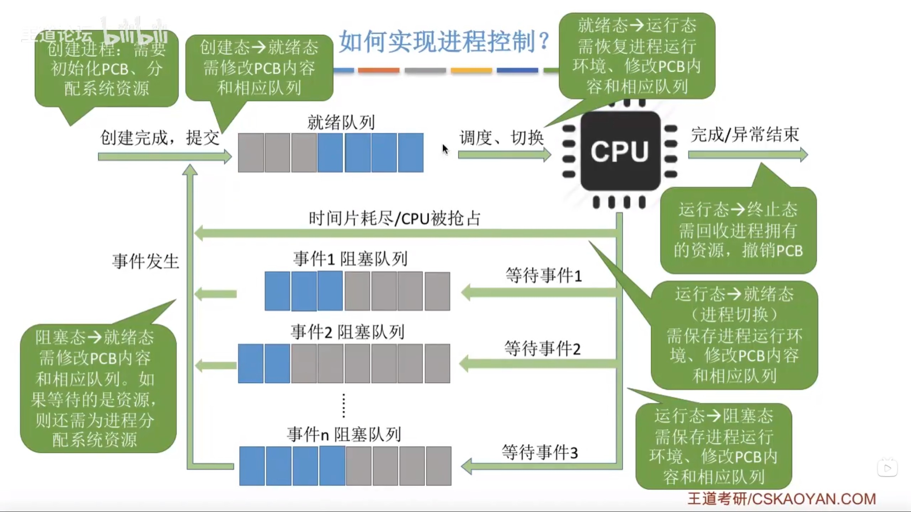

用**原语**实现进程控制。**原语的特点是执行期间不允许中断**，只能一气呵成。

这种不可被中断的操作即**原子操作**。

原语采用“**关中断指令**”和“**开中断指令**”实现。

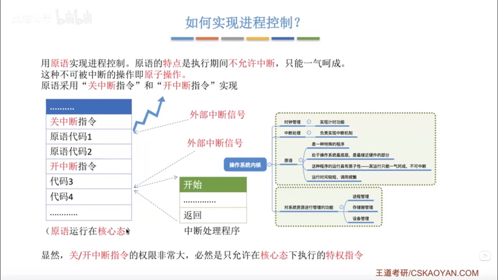

显然，关/开中断指令的权限非常大，必然是只允许在核心态下执行的特权指令。

### 6.2. 进程控制相关的原语

学习技巧：进程控制会导致进程状态的转换。无论哪个原语，要做的无非三类事情：

1. 更新 PCB 中的信息（如修改进程状态标志、将运行环境保存到 PCB、从 PCB 恢复运行环境）
   1. 所有的进程控制原语一定都会修改进程状态标志
   2. 剥夺当前运行进程的 CPU 使用权必然需要保存其运行环境
   3. 某进程开始运行前必然要恢复期运行环境
2. 将 PCB 插入合适的队列
3. 分配 / 回收资源

#### 6.2.1. 进程的创建

$$
无 \rightarrow 创建态 \rightarrow 就绪态
$$

创建原语：

- 申请空白 PCB
- 为新进程分配所需资源
- 初始化 PCB
- 将 PCB 插入就绪队列

引起进程创建的事件：

- 用户登录：分时系统中，用户登录成功，系统会建立为其建立一个新的进程决
- 作业调度：多道批处理系统中，有新的作业放入内存时，会为其建立一个新的进程
- 提供服务：用户向操作系统提出某些请求时，会新建一个进程处理该请求
- 应用请求：由用户进程主动请求创建一个子进程

#### 6.2.2. 进程的终止

$$
就绪态/阻塞态/运行态 \rightarrow 终止态 \rightarrow 无
$$

撤销原语：

- 从 PCB 集合中找到终止进程的 PCB
- 若进程正在运行，立即剥夺 CPU，将 CPU 分配给其他进程
- 终止其所有子进程
- 将该进程拥有的所有资源归还给父进程或操作系统
- 删除 PCB

引起进程终止的事件：

- 正常结束
- 异常结束
- 外界干预

#### 6.2.3. 进程的阻塞

$$
运行态 \rightarrow 阻塞态
$$

阻塞原语：

- 找到要阻塞的进程对应的 PCB
- 保护进程运行现场，将 PCB 状态信息设置为“阻塞态"，暂时停止进程运行
- 将 PCB 插入相应事件的等待队列

引起进程阻塞的事件：

- 需要等待系统分配某种资源
- 需要等待相互合作的其他进程完成工作

#### 6.2.4. 进程的唤醒

$$
阻塞态 \rightarrow 就绪态
$$

唤醒原语：

- 在事件等待队列中找到 PCB
- 将 PCB 从等待队列移除，设置进程为就绪态
- 将 PCB 插入就绪队列，等待被调度

引起进程唤醒的事件：

- 等待事件的发生

> 注意：阻塞原语、唤醒原语必须成对使用。因何事阻塞，就应由何事唤醒。

#### 6.2.5. 进程的切换

$$
就绪态 \rightarrow 运行态
$$

$$
运行态 \rightarrow 就绪态 / 阻塞态
$$

切换原语：

- 将运行环境信息存入 PCB
- PCB 移入相应队列
- 选择另一个进程执行，并更新其 PCB
- 根据 PCB 恢复新进程所需的运行环境

引起进程切换的事件：

- 当前进程时间片到
- 有更高优先级的进程到达
- 当前进程主动阻塞
- 当前进程终止

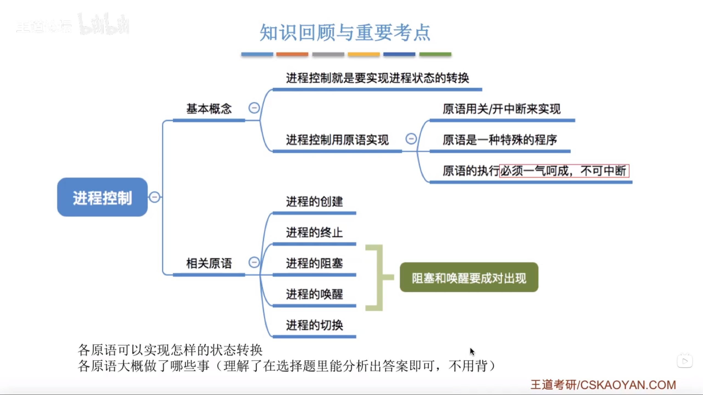

## 7. 进程通信

- 共享存储
  - 基于数据结构的共享
  - 基于存储区的共享
- 消息传递
  - 直接通信方式
  - 间接通信方式
- 管道通信

顾名思义，进程通信就是指进程之间的信息交换进程是分配系统资源的单位（包括内存地址空间），因此**各进程**拥有的**内存地址空间相互独立**。

为了保证安全，一个进程不能直接访问另个进程的地址空间。

但是进程之间的信息交换又是必须实现的。

为了保证进程间的安全通信，操作系统提供了一些方法。

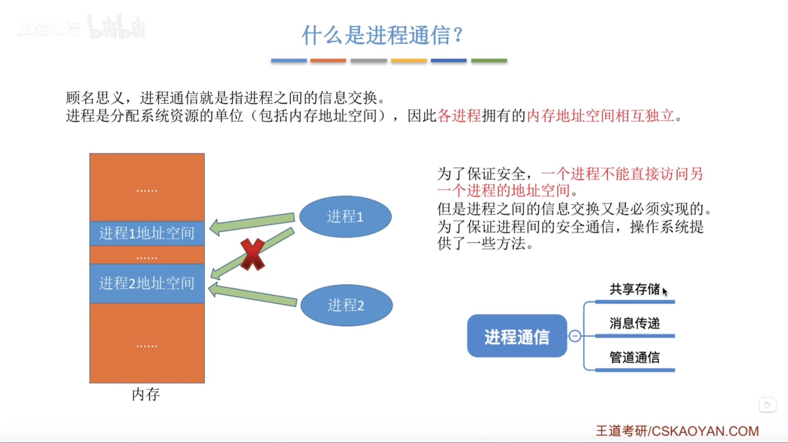

### 7.1. 共享存储

两个进程对共享空间的访问必须是互斥的（互斥访问通过操作系统提供的工具实现）。

操作系统只负责提供共享空间和同步互斥工具（如 P、V 操作）。

**基于数据结构**的共享：比如共享空间里只能放个长度为 10 的数组。这种共享方式速度慢、限制多，是一种**低级通信**方式。

**基于存储区**的共享：在内存中画出一块共享存储区，数据的形式、存放位置都由进程控制，而不是操作系统。相比之下，这种共享方式速度更快，是一种**高级通信**方式。

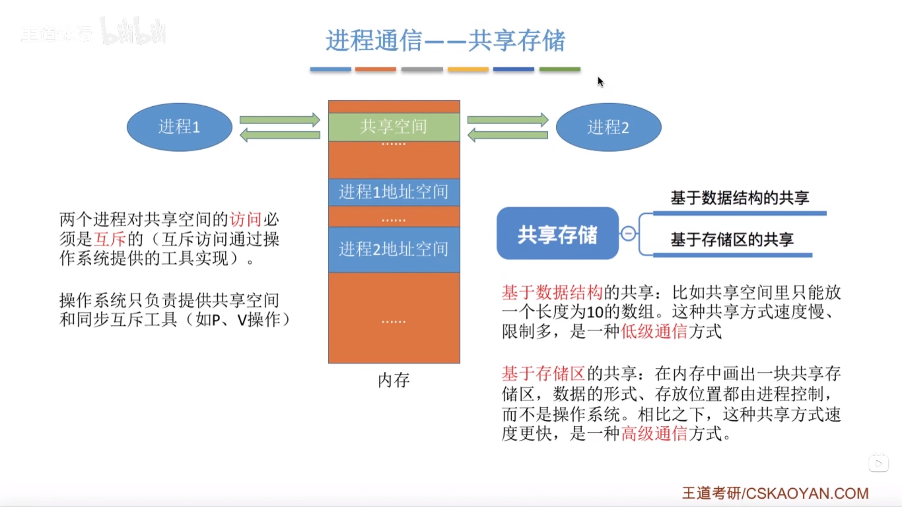

### 7.2. 管道通信

“管道”是指用于连接读写进程的一个共享文件，又名 pipe 文件。其实就是在内存中开辟个大小固定的缓冲区。

1. 管道只能采用**半双工通信**，某一时间段内只能实现单向的传输。如果要实现**双向同时通信**，则**需要设置两个管道**。
2. 各进程要**互斥**地访问管道。
3. 数据以字符流的形式写入管道，当**管道写满**时，**写进程**的 write() 系统调用将被**阻塞**，等待读进程将数据取走。当读进程将数据全部取走后，**管道变空**，此时**读进程**的 read() 系统调用将被**阻塞**。
4. 如果**没写满，就不允许读**。如果**没读空，就不允许写**。
5. 数据一旦被读岀，就从管道中被抛拋弃，这就意味着**读进程最多只能有一个**，否则可能会有读错数据的情况。

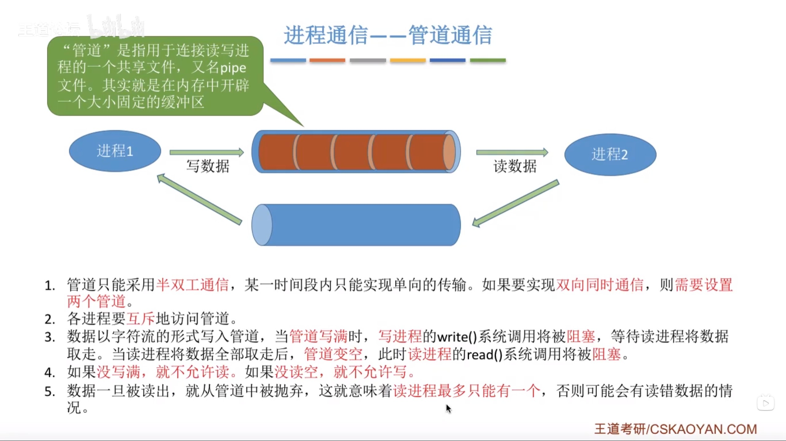

### 7.3. 消息传递

进程间的数据交换以格式化的消息（Message）为单位。进程通过操作系统提供的“发送消息/接收消息”两个原语进行数据交换。

消息头包括：发送进程 ID、接受进程 ID、消息类型、消息长度等格式化的信息（计算机网络中发送的“报文”其实就是种格式化的消息）

- 直接通信方式：消息直接挂到接收进程的消息缓冲队列上
- 间接通信方式：消息要先发送到中间实体（信箱）中，因此也称“信箱通信方式”。Eg：计网中的电子邮件系统

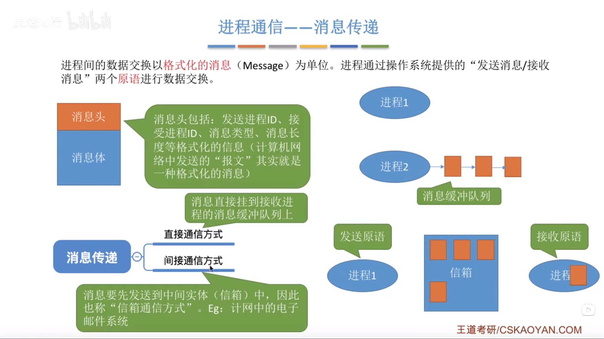

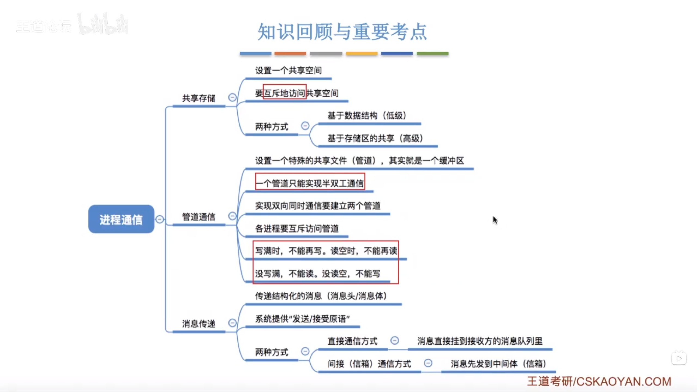

## 8. 线程概念和多线程模型

- 什么是线程，为什么要引入线程？
- 引入线程机制后，有什么变化？
- 线程有哪些重要的属性？
- 线程的实现方式
  - 用户级线程
  - 内核级线程
- 多线程模型
  - 多对一模型
  - 一对一模型
  - 多对多模型

### 8.1. 线程

有的进程可能需要“同时”做很多事，而传统的进程只能串行地执行一系列程序。为此，引入了“线程”，来增加并发度。

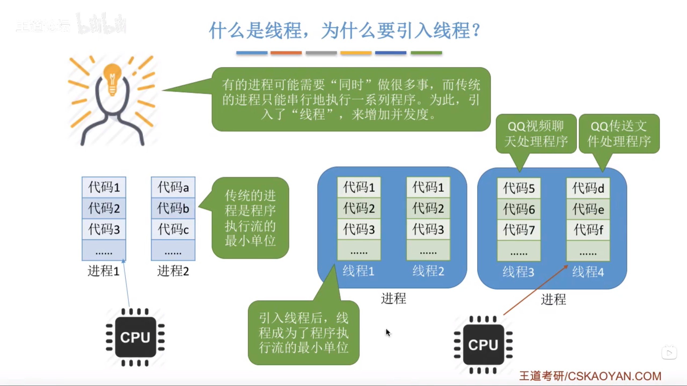

- 传统的进程是程序执行流的最小单位
- 引入线程后，线程成为了程序执行流的最小单位

可以把线程理解为“轻量级进程”。

**线程**是一个**基本的 CPU 执行单元**，也是程序**执行流的最小单位**。

引入线程之后，不仅是进程之间可以并发，进程内的**各线程之间也可以并发**，从而进一步**提升了系统的并发度**，使得一个进程内也可以并发处理各种任务（如 QQ 视频、文字聊天、传文件）。

引入线程后，**进程**只作为**除 CPU 之外的系统资源的分配单元**（如打印机、内存地址空间等都是分配给进程的）。

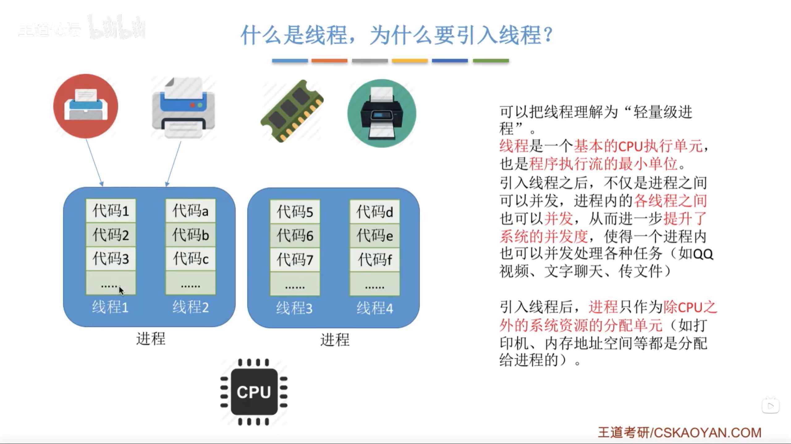

### 8.2. 引入线程后的变化

- 资源分配、调度
  - 传统进程机制中，进程是资源分配、调度的基本单位
  - 引入线程后，进程是资源分配的基本单位，线程是调度的基本单位
- 并发性
  - 传统进程机制中，只能进程间并发
  - 引入线程后，各线程间也能并发，提升了并发度
- 系统开销
  - 传统的进程间并发，需要切换进程的运行环境，系统开销很大
  - 线程间并发，如果是同一进程内的线程切换，则不需要切换进程环境，系统开销小
  - 引入线程后，并发所带来的系统开销减小

### 8.3. 线程的属性

- 线程是**处理机调度的单位**
- 多 CPU 计算机中，各个线程可占用不同的 CPU
- 每个线程都有一个**线程 ID**、**线程控制块**（**TCB**）
- 线程也有**就绪**、**阻塞**、**运行**三种基本状态
- 线程几乎不拥有系统资源
- 同一进程的不同线程间共享进程的资源
- 由于共享内存地址空间，同一进程中的线程间通信甚至无需系统
- 干预同一进程中的线程切换，不会引起进程切换
- 不同进程中的线程切换，会引起进程切换
- 切换同进程内的线程，系统开销很小
- 切换进程，系统开销较大

### 8.4. 线程的实现方式

#### 8.4.1. 用户级线程

用户级线程（User-Level Thread，ULT）由应用程序通过线程库实现。

所有的**线程管理工作**都由**应用程序负责**（包括线程切换）。

用户级线程中，**线程切换**可以在**用户态下即可完成**，无需操作系统干预。

在用户看来，是有多个线程。但是在操作系统内核看来，并意识不到线程的存在。（**用户级线程对用户不透明，对操作系统透明**）

可以这样理解，“**用户级线程**”就是“**从用户视角看能看到的线程**”。

#### 8.4.2. 内核级线程

内核级**线程的管理工作**由**操作系统内核**完成。

线程调度、切换等工作都由内核负责，因此**内核级线程的切换**必然需要在**核心态**下才能完成。

可以这样理解，“**内核级线程**”就是“**从操作系统内核视角看能看到的线程**”。

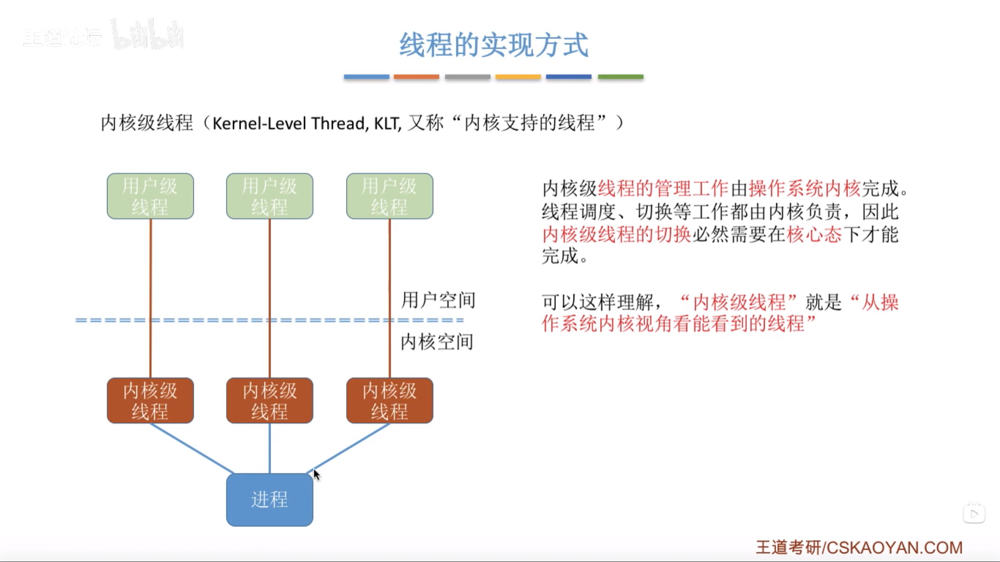

### 8.5. 多线程模型

在同时支持用户级线程和内核级线程的系统中，可采用二者组合的方式：将 n 个用户级线程映射到 m 个内核级线程上（n>=m）。

操作系统只“看得见”内核级线程，因此只有**内核级线程才是处理机分配的单位**。

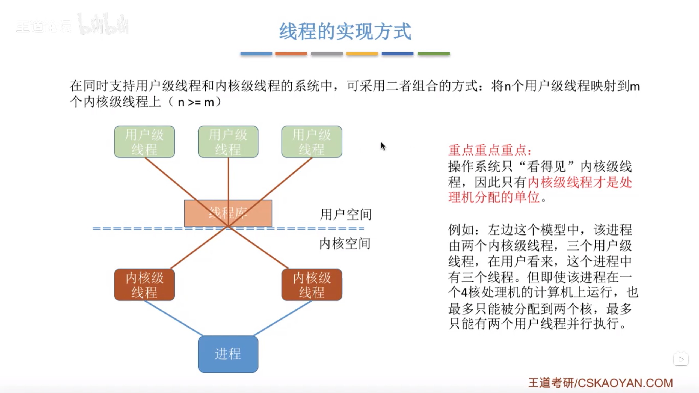

#### 8.5.1. 多对一模型

多对一模型：多个用户级线程映射到一个内核级线程。每个用户进程只对应一个内核级线程。

优点：

- 用户级线程的切换在用户空间即可完成，不需要切换到核心态
- 线程管理的系统开销小，效率高

缺点：

- 当一个用户级线程被阻塞后，整个进程都会被阻塞，并发度不高
- 多个线程不可在多核处理机上并行运行

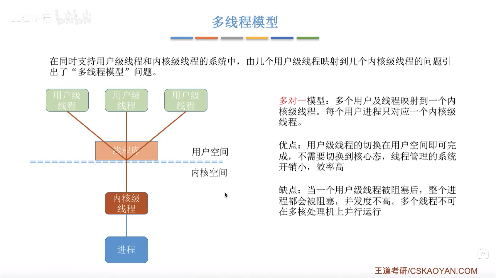

#### 8.5.2. 一对一模型

一对一模型：一个用户及线程映射到一个内核级线程。每个用户进程有与用户级线程同数量的内核级线程。

优点：

- 当一个线程被阻塞后，别的线程还可以继续执行，并发能力强
- 多线程可在多核处理机上并行执行

缺点：

- 一个用户进程会占用多个内核级线程
- 线程切换由操作系统内核完成，需要切换到核心态
- 线程管理的成本高，开销大。

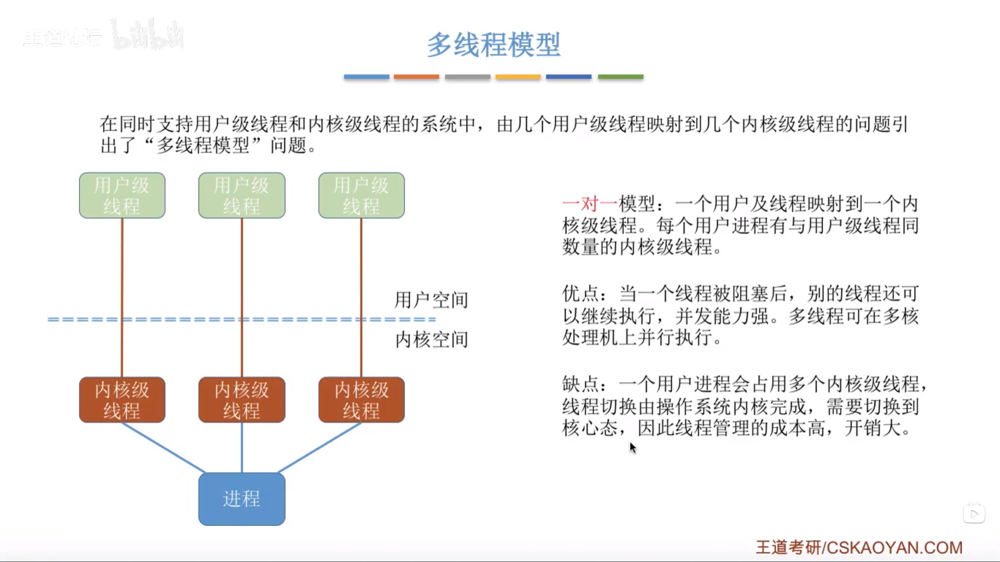

#### 8.5.3. 多对多模型

多对多模型：n 用户及线程映射到 m 个内核级线程（n>=m）。每个用户进程对应 m 个内核级线程。

克服了多对一模型并发度不高的缺点，又克服了一对一模型中一个用户进程占用太多内核级线程，开销太大的缺点。

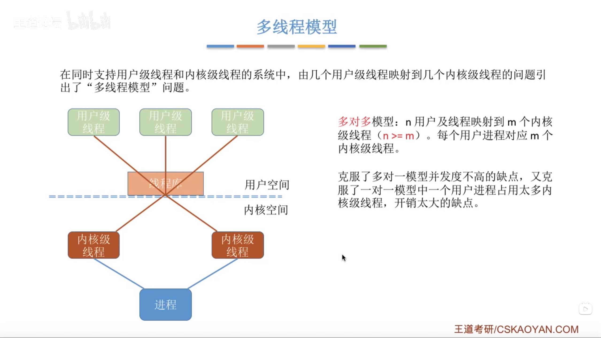

## 9. 处理机的调度和层次

- 基本概念
- 三个层次
  - 高级调度（作业调度）
  - 中级调度（内存调度）（引出“七状态”模型）
  - 低级调度（进程调度）
- 三层调度的联系、对比
- 补充知识
  - 进程的挂起态
  - “七状态”模型

### 9.1. 处理机调度

当有一堆任务要处理，但由于资源有限，这些事情没法冋时处理。这就需要确定**某种规则**来**决定**处理这些任务的**顺序**，这就是“调度”研究的问题。

在多道程序系统中，进程的数量往往是多于处理机的个数的，这样不可能同时并行地处理各个进程。

**处理杋调度**，就是从就绪队列中**按照一定的算法选择一个进程**并**将处理机分配给它**运行，以实现进程的并发执行。

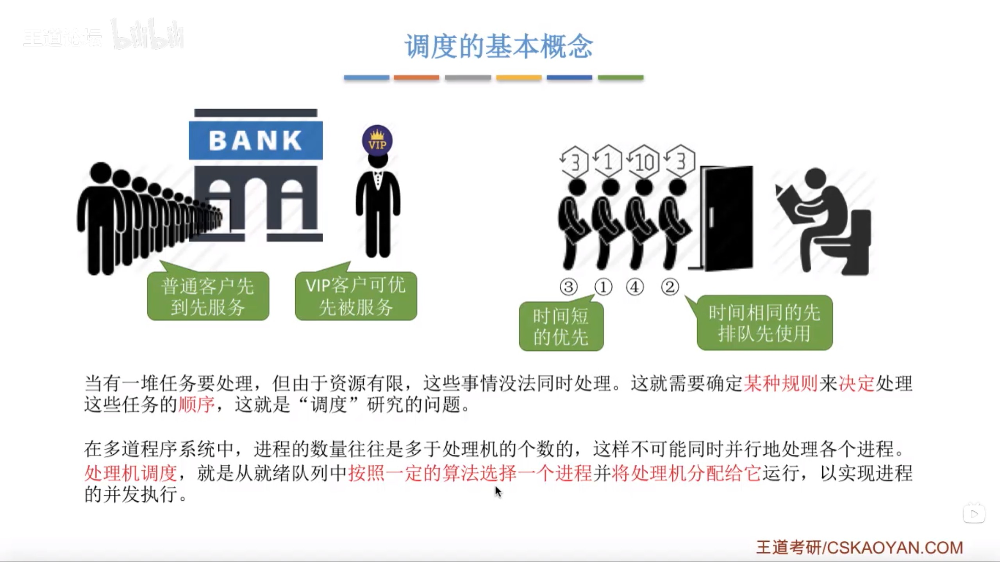

### 9.2. 高级调度

由于内存空间有限，有时无法将用户提交的作业全部放入内存，因此就需要确定某种规则来决定将作业调入内存的顺序。

**高级调度（作业调度）**。按一定的原则从外存上处于后备队列的作业中挑选一个（或多个）作业，给他们分配内存等必要资源，并**建立相应的进程（建立 PCB）**，以使它（们）**获得竞争处理机的权利**。

高级调度是辅存（外存）与内存之间的调度。每个作业**只调入一次，调出一次**。

**作业调入时会建立相应的 PCB，作业调出时才撤销 PCB**。

高级调度主要是指**调入**的问题，因为只有调入的时机需要操作系统来确定，但调出的时机必然是作业运行结束才调出。

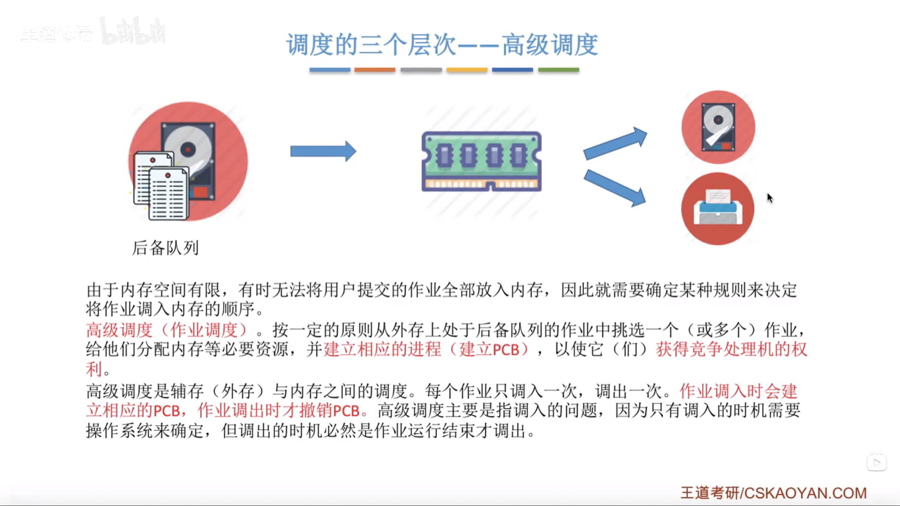

### 9.3. 中级调度

引入了虚拟存储技术之后，可将暂时不能运行的进程调至外存等待。等它重新具备了运行条件且内存又稍有空闲时，再重新调入内存。

这么做的目的是为了**提高内存利用率**和**系统吞吐量**。

暂时调到外存等待的进程状态为**挂起状态**。值得注意的是，**PCB** 并不会一起调到外存，而是会**常驻内存**。

PCB 中会记录进程数据在外存中的存放位置，进程状态等信息，操作系统通过内存中的 PCB 来保持对各个进程的监控、管理。

被挂起的进程 PCB 会被放到的**挂起队列**中。

**中级调度（内存调度）**，就是要决定将哪个处于挂起状态的进程重新调入内存。

一个进程可能会被**多次调出、调入内存**，因此**中级调度**发生的**频率**要比高级调度**更高**。

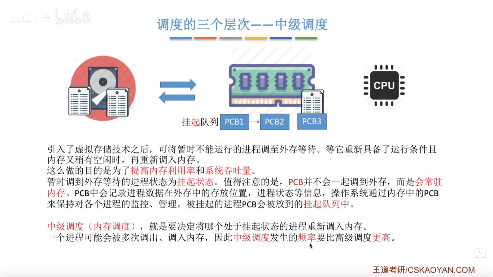

暂时调到外存等待的进程状态为**挂起状态（挂起态，suspend）**。

挂起态又可以进一步细分为**就绪挂起**、**阻塞挂起**两种状态

$$
五状态模型 \rightarrow 七状态模型
$$

> 注意：
>
> “挂起”和“阻塞”的区别，
>
> 两种状态都是暂时不能获得 CPU 的服务，
>
> 但挂起态是将进程映像调到外存去了，
>
> 而阻塞态下进程映像还在内存中。

有的操作系统会把就绪挂起、阻塞挂起分为两个挂起队列。

甚至会根据阻塞原因不同再把阻塞挂起进程进一步细分为多个队列。

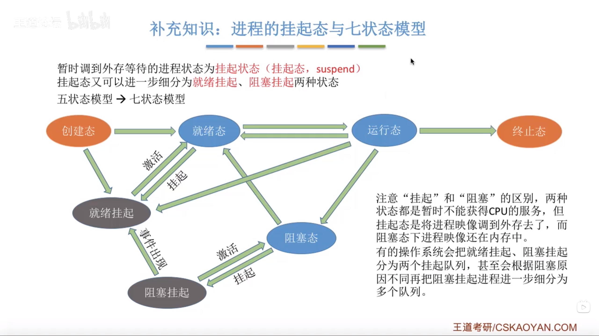

### 9.4. 低级调度

**低级调度（进程调度）**，其主要任务是按照某种方法和策略从就绪队列中选取一个进程，将处理机分配给它。

进程调度是操作系统中**最基本的一种调度**，在一般的操作系统中都必须配置进程调度。

进程调度的**频率很高**，一般几十毫秒一次。

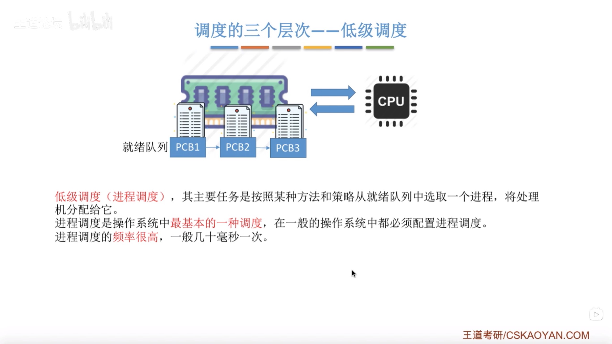

### 9.5. 三层调度的联系和区别

- 高级调度（**作业调度**）
  - 按照某种规则，从后备队列中选择合适的作业将其调入内存，并为其创建进程
  - $外存 \rightarrow 内存$（面向作业）
  - 频率最低
  - $无 \rightarrow 创建态 \rightarrow 就绪态$
- 中级调度（**内存调度**）
  - 按照某种规则，从挂起队列中选择合适的进程将其数据调回内存
  - $外存 \rightarrow 内存$（面向进程）
  - 频率中等
  - $挂起态 \rightarrow 就绪态（阻塞挂起 \rightarrow 阻塞态）$
- 低级调度（**进程调度**）
  - 按照某种规则，从就绪队列中选择一个进程为其分配处理机
  - $内存 \rightarrow CPU$
  - 频率最高
  - $就绪态 \rightarrow 运行态$

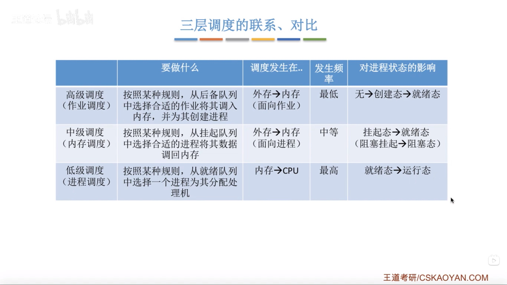

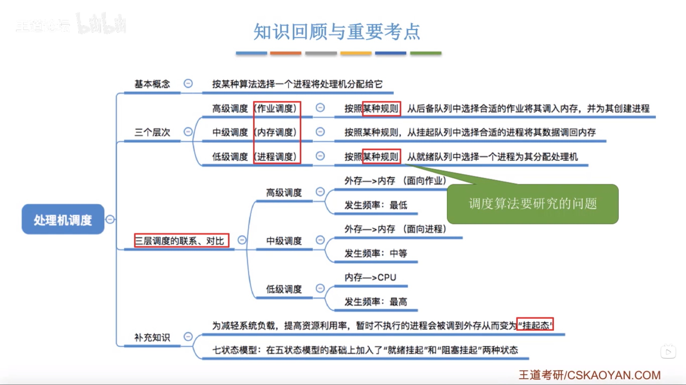

## 10. 进程调度的时机、切换与过程、方式

- 时机
  - 什么时候需要进程调度（引出进程调度的方式）
  - 什么时候不能进行进程调度
- 切换与过程
  - “狭义的调度”与“切换"的区别
  - 进程切换的过程需要做什么？
- 方式
  - 非剥夺调度方式（非抢占式）
  - 剥夺调度方式（抢占式）

### 10.1. 时机

**进程调度**（低级调度），就是按照某种算法从就绪队列中选择一个进程为其分配处理机。

**需要进行**进程调度与切换的情况：

- 当前运行的进程**主动放弃**处理机
  - 进程正常终止
  - 运行过程中发生异常而终止
  - 进程主动请求阻塞（如等待 I/O）
- 当前运行的进程**被动放弃**处理机
  - 分给进程的时间片用完
  - 有更紧急的事需要处理（如 I/O 中断）
  - 有更高优先级的进程进入就绪队列

**不能进行**进程调度与切换的情况：

- 在**处理中断的过程中**。中断处理过程复杂，与硬件密切相关，很难做到在中断处理过程中进行进程切换
- 进程在**操作系统内核程序临界区**中。
- 在**原子操作过程中**（原语）。原子操作不可中断，要一气呵成（如之前讲过的修改 PCB 中进程状态标志，并把 PCB 放到相应队列）

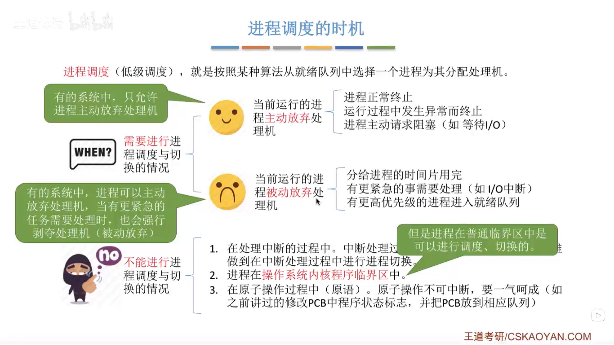

进程在**操作系统内核程序临界区**中**不能**进行调度与切换。（正确）

（2012 年联考真题）进程处于**临界区**时**不能**进行处理机调度。（错误）

- 临界资源：一个时间段内只允许一个进程使用的资源。各进程需要互斥地访问临界资源。
- 临界区：访问临界资源的那段代码。

**内核程序临界区**一般是用来访问**某种内核数据结构**的，比如进程的就绪队列（由各就绪进程的 PCB 组成）

#### 10.1.1. 进程访问内核程序临界区

如果某个进程还没退出内核程序临界区（还没解锁）就进行进程调度，但是进程调度相关的程序也需要访问**就绪队列**，但此时就绪队列被锁住了，因此又无法顺利进行进程调度。

内核程序临界区访问的临界资源如果不尽快释放的话，极有可能影响到操作系统内核的其他管理工作。因此在访问内核程序临界区期间不能进行调度与切换。

#### 10.1.2. 进程访问普通临界区

在打印机打印完成之前，进程一直处于临界区内，临界资源不会解锁。但打印机又是慢速设备，此时如果一直不允许进程调度的话就会导致 CPU 一直空闲。

普通临界区访问的临界资源不会直接影响操作系统内核的管理工作。因此在访问普通临界区时可以进行调度与切换。

### 10.2. 方式

- **非剥夺调度方式**，又称**非抢占方式**
  - 只允许进程主动放弃处理机。在运行过程中即便有更紧迫的任务到达，当前进程依然会继续使用处理机，直到该进程终止或主动要求进入阻塞态
  - 实现简单，系统开销小但是无法及时处理紧急任务
  - 适合于早期的批处理系统
- **剥夺调度方式**，又称**抢占方式**
  - 当一个进程正在处理机上执行时，如果有一个更重要或更紧迫的进程需要使用处理机，则立即暂停正在执行的进程，将处理机分配给更重要紧迫的那个进程
  - 可以优先处理更紧急的进程，也可实现让各进程按时间片轮流执行的功能（通过时钟中断）
  - 适合于分时操作系统、实时操作系统

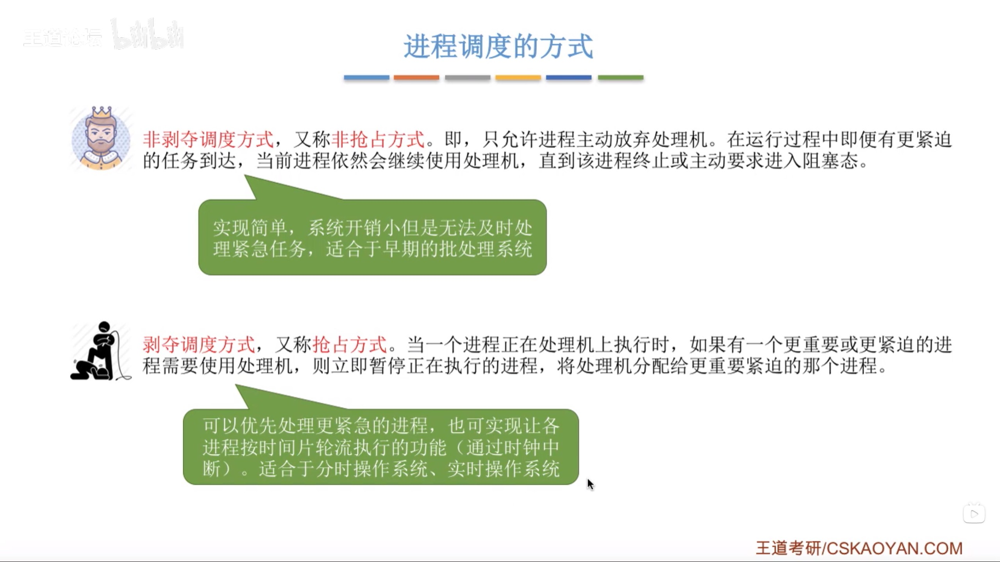

### 10.3. 切换与过程

“狭义的进程调度”与“进程切换”的区别：

**狭义的进程调度**指的是从就绪队列中**选中一个要运行的进程**。（这个进程可以是刚刚被暂停执行的进程，也可能是**另一个进程**，后一种情况就需要**进程切换**）

**进程切换**是指一个进程让出处理机，由另一个进程占用处理机的过程。

**广义的进程调度**包含了选择一个进程和进程切换两个步骤。

进程切换的过程主要完成了：

1. 对原来运行进程各种数据的保存
2. 对新的进程各种数据的恢复（如：程序计数器、程序状态字、各种数据寄存器等处理杋现场信息，这些信息一般保存在进程控制块）

注意：**进程切换是有代价的**，因此如果**过于频繁的**进行进程**调度、切换**，必然会使整个**系统的效率降低**，使系统大部分时间都花在了进程切换上，而真正用于执行进程的时间减少。

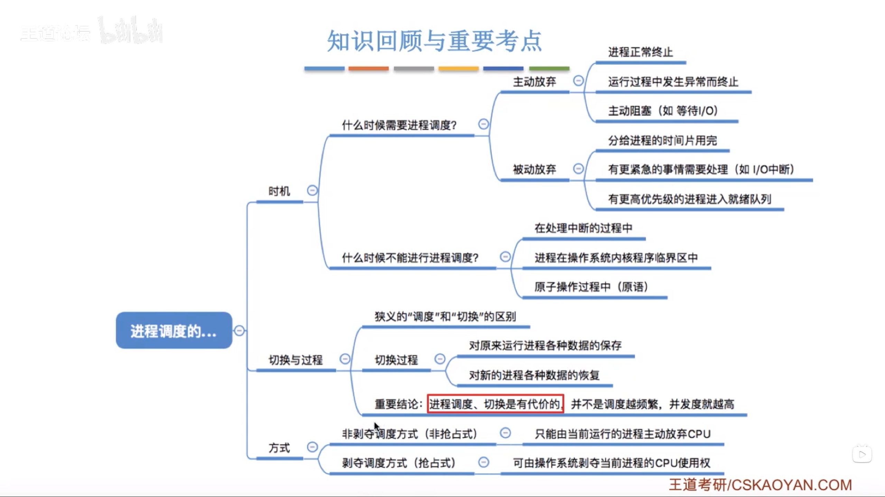

## 11. 调度算法的评价指标

- CPU 利用率
- 系统吞吐量
- 周转时间
  - 周转时间、平均周转时间
  - 带权周转时间、平均带权周转时间
- 等待时间
- 响应时间

### 11.1. CPU 利用率

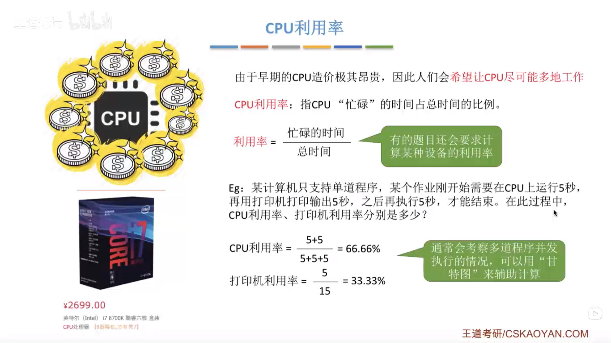

### 11.2. 系统吞吐量

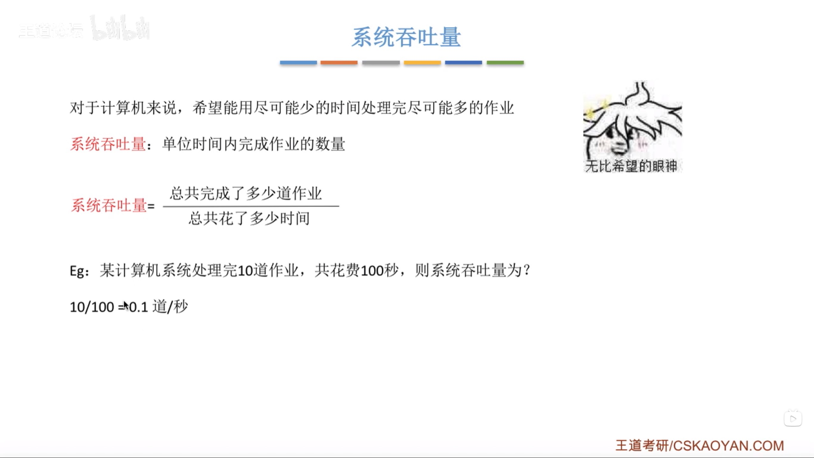

### 11.3. 周转时间

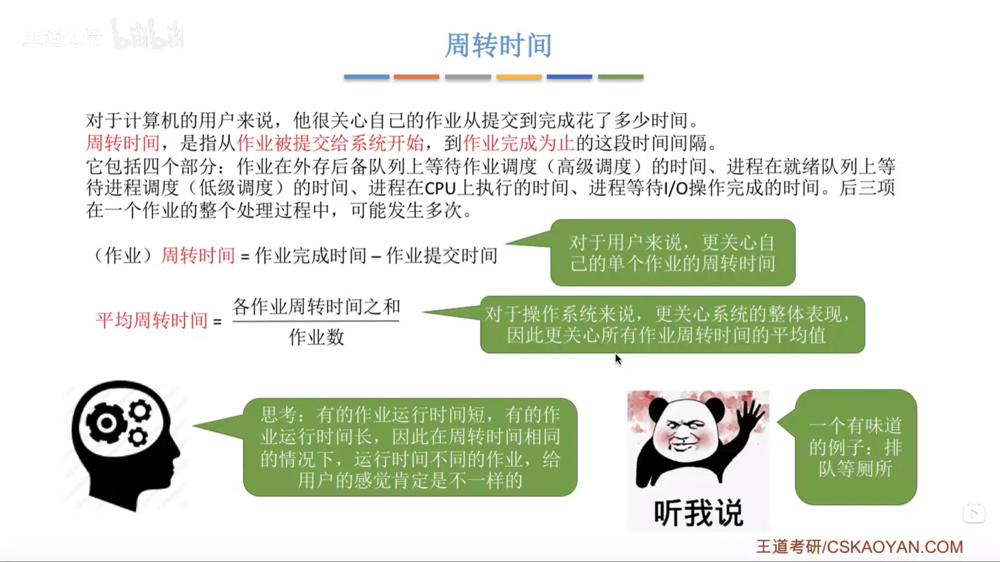

### 11.4. 带权周转时间

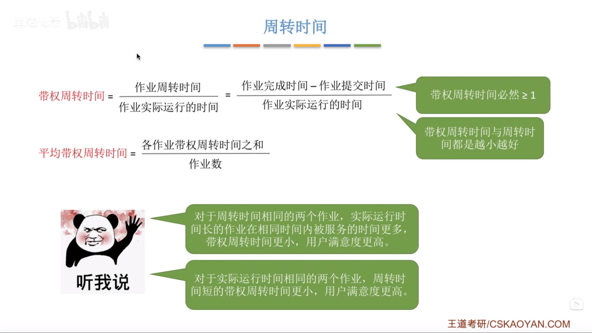

### 11.5. 等待时间

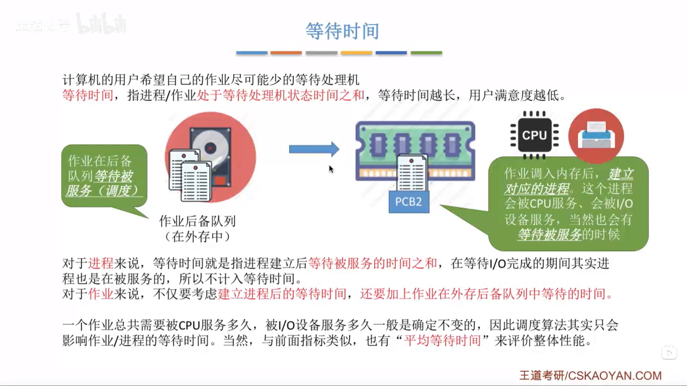

### 11.6. 响应时间

对于计算机用户来说，会希望自己的提交的请求（比如通过键盘输入了一个调试命令）尽早地开始被系统服务、回应。

**响应时间**，指从用户**提交请求**到**首次产生响应**所用的时间。

<!--  -->

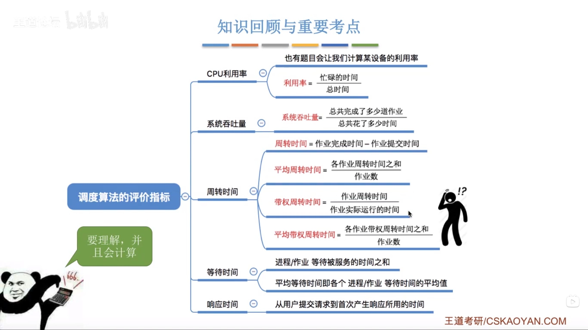

## 12. 调度算法

- 先来先服务（FCFS）
- 短作业优先（SJF）
- 高响应比优先（HRRN）

Tips：各种调度算法的学习思路：

1. 算法思想
2. 算法规则
3. 这种调度算法是用于作业调度还是进程调度？
4. 抢占式？非抢占式？
5. 优点和缺点
6. 是否会导致**饥饿**：某个进程/作业长期得不到服务

### 12.1. 先来先服务

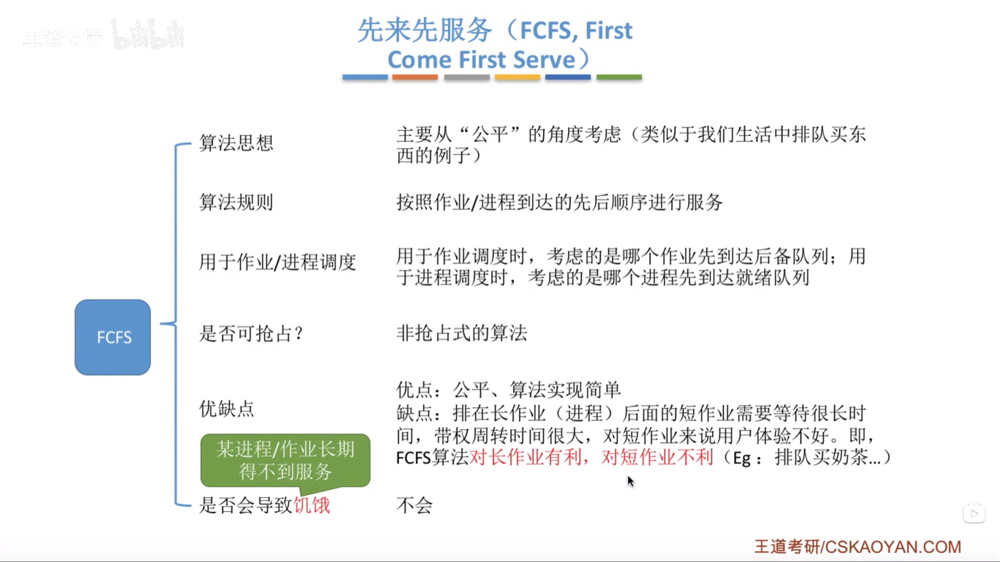

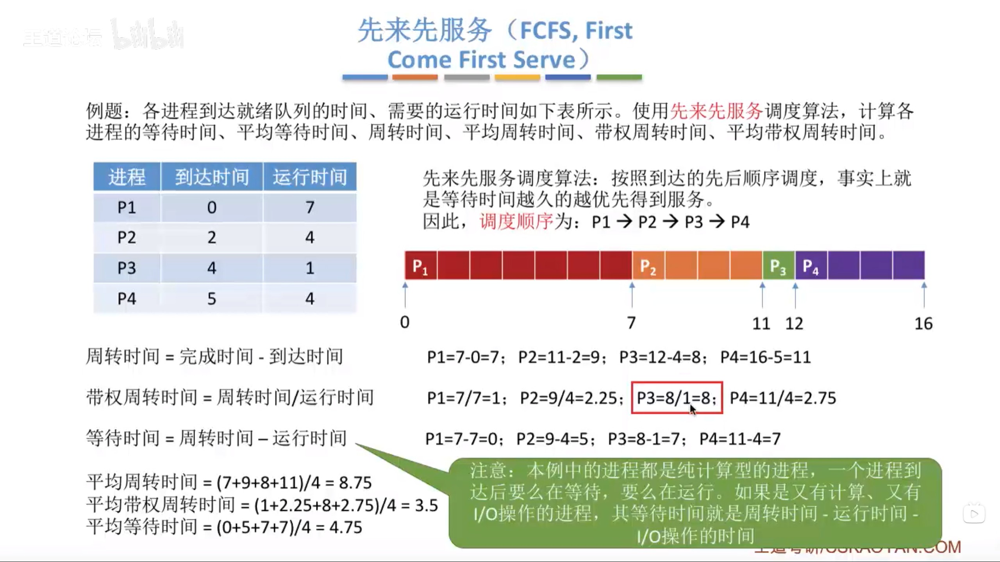

### 12.2. 短作业优先

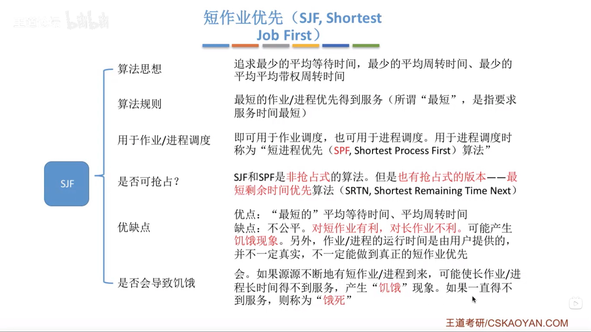

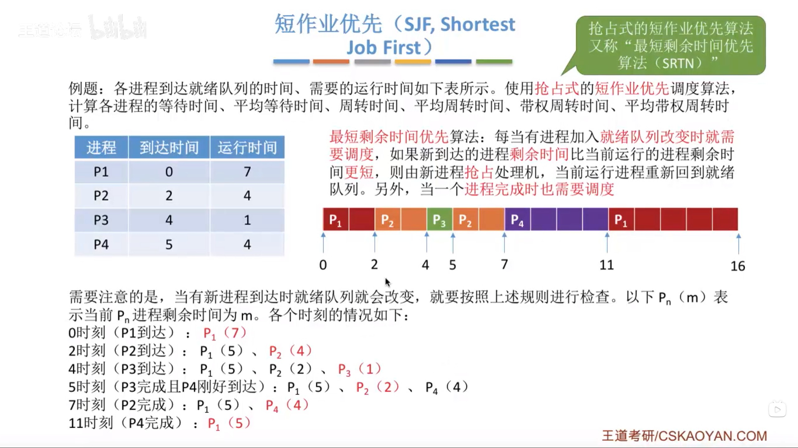

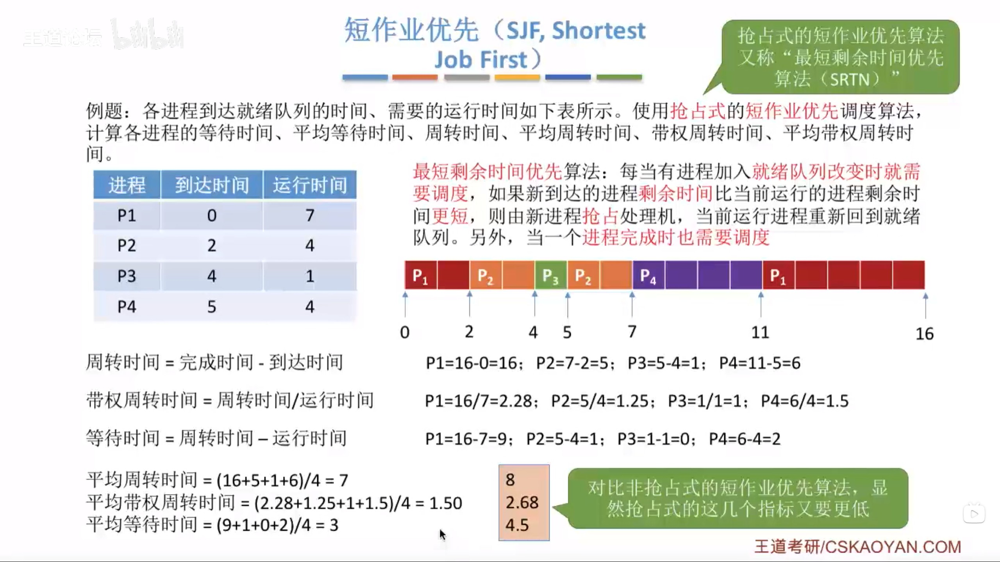

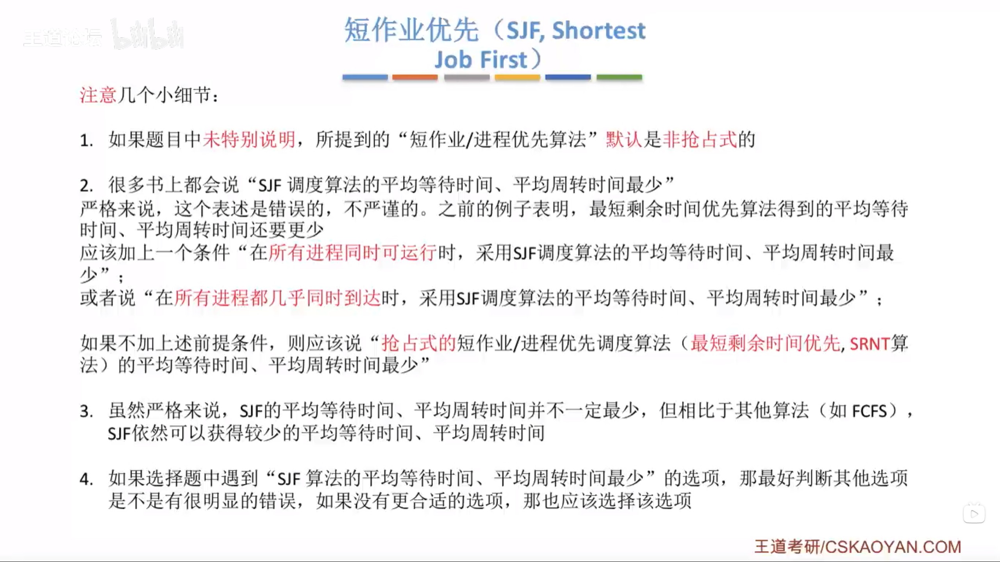

### 12.3. 高响应比优先

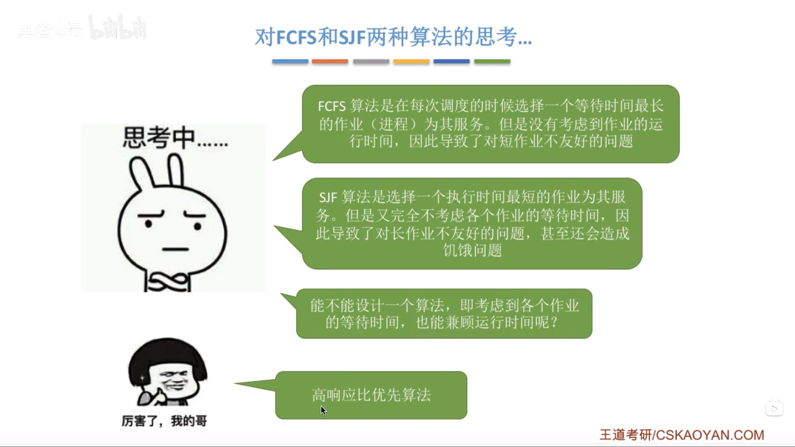

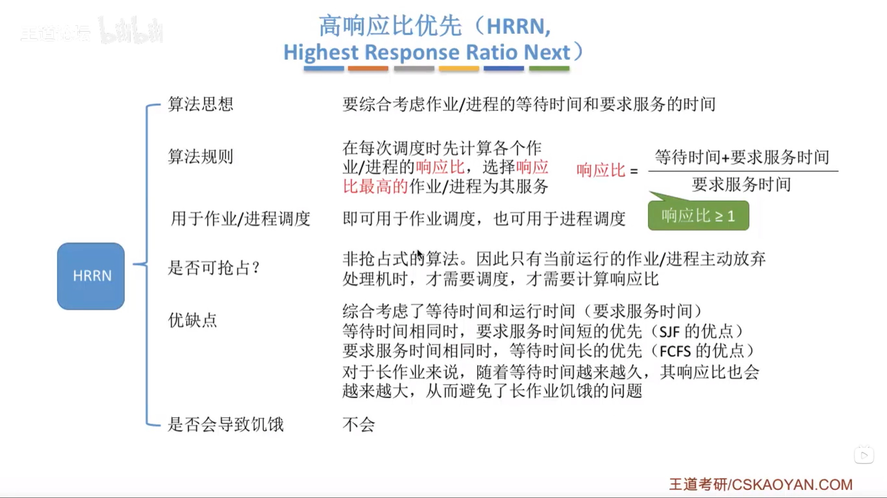

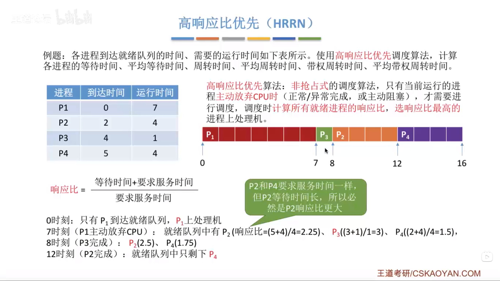

注：这几种算法主要关心对用户的公平性、平均周转时间、平均等待时间等评价系统整体性能的指标，但是不关心“响应时间”，也并不区分任务的紧急程度，因此对于用户来说，交互性很糟糕。

因此这三种算法一般适合用于早期的批处理系统，当然，FCFS 算法也常结合其他的算法使用，在现在也扮演着很重要的角色。

而适合用于交互式系统的调度算法将在下个小节介绍。

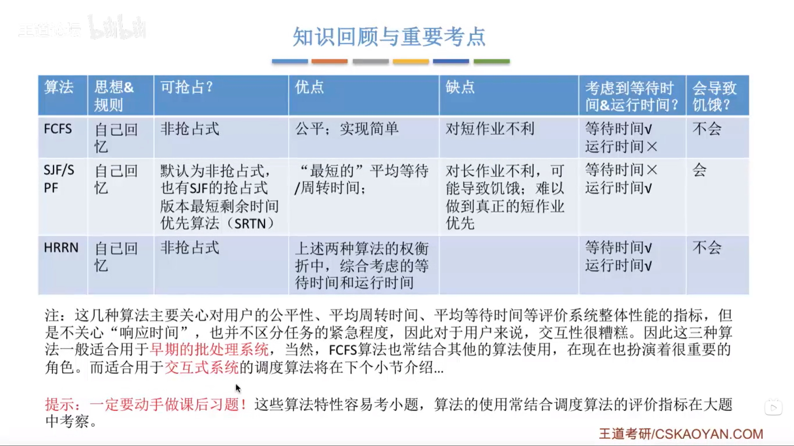
